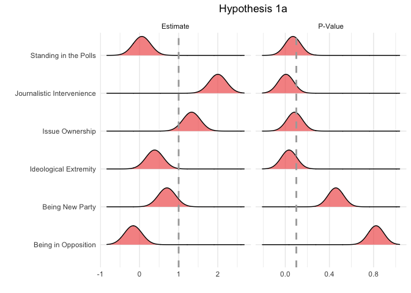

Analysis
================
Dirck de Kleer & Mariken A.C.G. van der Velden

# Scripts

  - [Required Packages &
    Reproducibility](#required-packages-&-reproducibility)
  - [Analysis](#analysis)
      - [H1a](#H1a)
      - [H1b](#H1b)
      - [H2a](#H2a)
      - [H2b](#H2b)

## Required Packages & Reproducibility

``` r
rm(list=ls())

source("../lib/functions.R")
```

## Analysis

``` r
load("../../data/intermediate/cleaned_data.RData")
df <- d %>%
  mutate(direction_appeal = recode(direction_appeal,
                                   `Negative Appeal` = 1,
                                   `Positive Appeal` = 0),) %>%
  group_by(date, party) %>%
  summarise(direction_appeal = sum(direction_appeal),
            polls  = mean(polls, na.rm = T),
            l_polls1 = mean(l_polls1, na.rm = T),
            l_polls7 = mean(l_polls7, na.rm = T),
            l_polls_mean = mean(l_polls_mean, na.rm = T),
            seats = mean(seats, na.rm = T),
            aio = mean(aio_percentage, na.rm = T),
            cio1 = mean(cio_mean, na.rm = T),
            cio2 = mean(cio_median, na.rm = T),
            cio3 = mean(cio_sd, na.rm = T),
            ie1 = mean(ie_median_ches2017, na.rm = T),
            ie2 = mean(ie_mean_ches2017, na.rm = T),
            ie3 = mean(ie_median_ches2014, na.rm = T),
            ie4 = mean(ie_mean_ches2014, na.rm = T),
            ie5 = mean(ie_median_cmp2017, na.rm = T),
            ie6 = mean(ie_mean_cmp2017, na.rm = T),
            ie7 = mean(ie_median_cmp2012, na.rm = T),
            ie8 = mean(ie_mean_cmp2012, na.rm = T),
            journalistic_intervenience  = mean(journalistic_intervenience, na.rm = T)
            ) %>%
  mutate(opposition = ifelse(party == "VVD", 0,
                      ifelse(party == "PvdA", 0, 1)),
         new_party = ifelse(party == "FvD", 1, 0)
         )  %>%
  ungroup()

df <- df %>%
  drop_na(-ie3, -ie4, -ie7, -ie8) 
```

### Multiverse Analysis

``` r
M <- multiverse()

inside(M, {
data <- df  %>%
    mutate(
      new_party = branch(np,
            "np_option" ~  ifelse(party=="FvD", 1, 0)),
      polls = branch(polls_calculation,
            "p_option1" ~ ifelse(party=="FvD", polls, round(polls/seats,2)),
            "p_option2" ~ ifelse(party=="FvD", polls, round(l_polls1/seats,2)),
            "p_option3" ~ ifelse(party=="FvD", polls, round(l_polls7/seats,2)),
            "p_option4" ~ ifelse(party=="FvD", polls, round(l_polls_mean/seats,2)),
            "p_option5" ~ ifelse(party=="FvD", polls, round(polls/l_polls1,2)),
            "p_option6" ~ ifelse(party=="FvD", polls, round(polls/l_polls7,2)),
            "p_option7" ~ ifelse(party=="FvD", polls, round(polls/l_polls_mean,2)),
            "p_option8" ~ ifelse(party=="FvD", polls, round(l_polls1/l_polls7,2)),
            "p_option9" ~ ifelse(party=="FvD", polls, round(l_polls1/l_polls_mean,2)))
           ) %>%
  mutate(ie = branch(ie_calculation,
            "ie_option1" ~ ie1,
            "ie_option2" ~ ie2,
            "ie_option3" %when% (np != "np_option1") ~ ie3,
            "ie_option4" %when% (np != "np_option1") ~ ie4,
            "ie_option5" ~ ie5,
            "ie_option6" ~ ie6,
            "ie_option7" %when% (np != "np_option1") ~ ie7,
            "ie_option8" %when% (np != "np_option1") ~ ie8)
         ) %>%
  mutate(io = branch(io_calculation,
            "io_option1" ~ aio,
            "io_option2" ~ cio1,
            "io_option3" ~ cio2,
            "io_option4" ~ cio3)
         )
})

n <- expand(M) %>% nrow()
```

``` r
inside(M, {
  fit_1 <- plm(direction_appeal ~ journalistic_intervenience + polls + ie1 + cio1 +
                  factor(opposition) + factor(new_party), 
                data=df, index=c("date"), model="within") 
})

inside(M, {
  summary_fit_1 <- fit_1 %>% 
    broom::tidy( conf.int = TRUE )
})

execute_multiverse(M)


h1a <- expand(M) %>%
  mutate( summary = map(.results, "summary_fit_1") ) %>%
  unnest( cols = c(summary) ) %>%
  filter( term != "(Intercept)" ) %>%
  select(term, estimate, p.value) %>%
  mutate(term = recode(term,
                       `cio1` = "Issue Ownership",
                       `factor(new_party)1` = "Being New Party",
                       `factor(opposition)1` = "Being in Opposition",
                       `ie1` = "Ideological Extremity",
                       `journalistic_intervenience` = "Journalistic Intervenience",
                       `polls` = "Standing in the Polls")) %>%
  pivot_longer(cols = estimate:p.value,
               names_to = "id") %>%
  mutate(id = recode(id, `estimate` = "Estimate",
                     `p.value` = "P-Value"))

dummy2 <- data.frame(id = c("Estimate", "P-Value"), Z = c(0, 0.1))
ggplot(h1a, aes(x = value, y = term, group = term)) +
  geom_density_ridges(scale = .5, alpha = 0.7, fill="#F1605DFF") +
  facet_grid(cols = vars(id), scales = "free") +
  theme_minimal() +
  labs(x = "", y = "", title = "Hypothesis 1a") +
  theme(plot.title = element_text(hjust = 0.5)) + 
    geom_vline(data = dummy2, aes(xintercept = Z), 
               linetype = "dashed", size = .3, colour = "darkgrey")
```

<!-- -->
