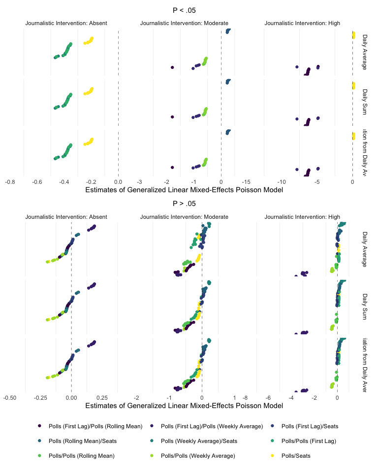
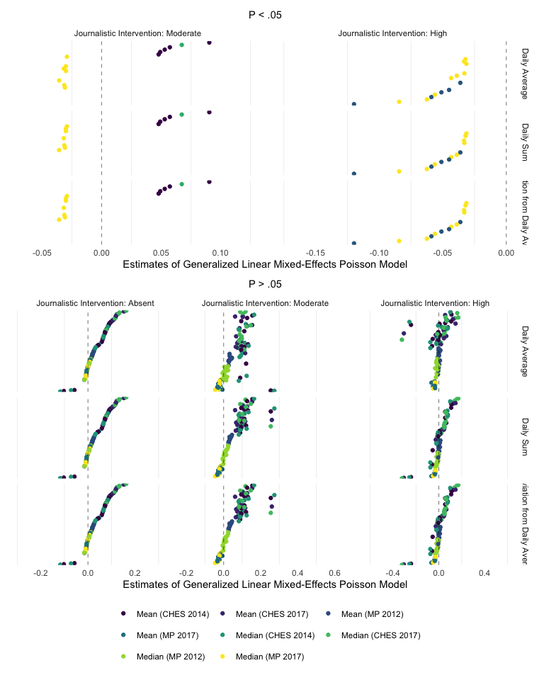
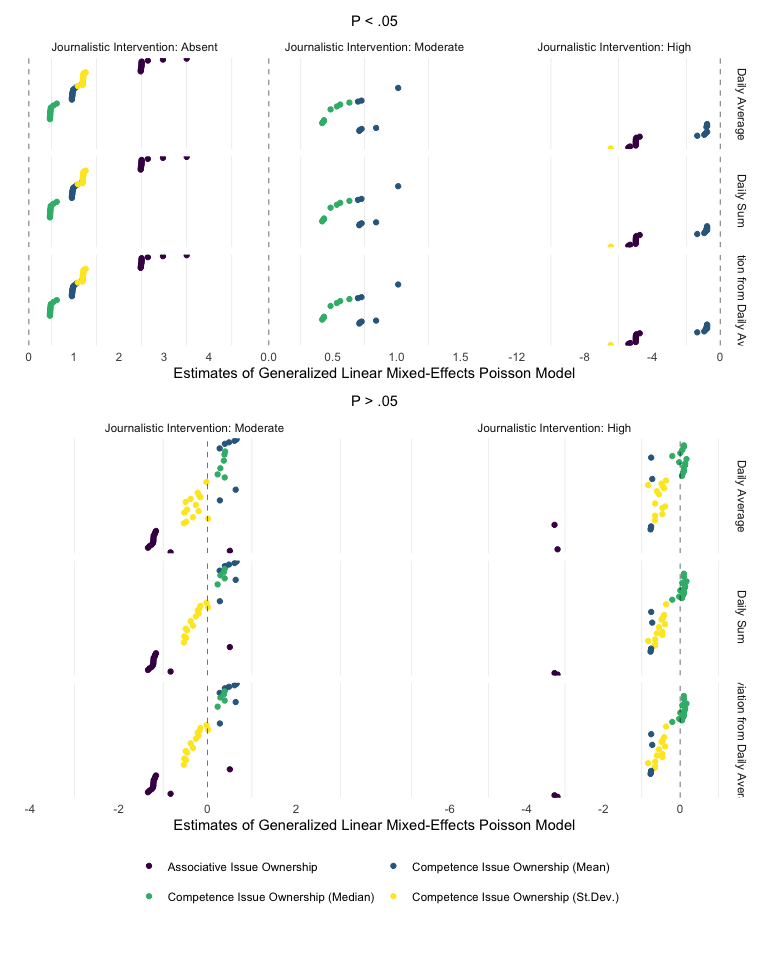

Analyses
================

# Scripts

  - [Required Packages &
    Reproducibility](#required-packages-&-reproducibility)
  - [Analyses](#analyses)
      - [H1 Direct Effect of Journalistic Control on Negative
        Appeals](#H1-Direct-Effect-of-Journalistic-Control-on-Negative-Appeals)
      - [H2 Interaction Effect of Polls with Journalistic Control on
        Negative
        Appeals](#H2-Interaction-Effect-of-Polls-with-Journalistic-Control-on-Negative-Appeals)
      - [H3 Interaction Effect of Ideological Extremity with
        Journalistic Control on Negative
        Appeals](#H3-Interaction-Effect-of-Ideological-Extremity-with-Journalistic-Control-on-Negative-Appeals)
      - [H4 Interaction Effect of Issue Ownership with Journalistic
        Control on Negative
        Appeals](#H4-Interaction-Effect-of-Issue-Ownership-with-Journalistic-Control-on-Negative-Appeals)

# Required Packages & Reproducibility

``` r
rm(list=ls())
source(here("src/lib/functions.R"))
```

# Analyses

To run a times-series Poisson model, the unit of analysis should be
`party_day`. Therefore, we use various ways to summarise our data to the
daily level.

``` r
load(here("data/intermediate/cleaned_data.RData"))
source(here("src/analysis/data-for-analyses.R"))
```

Next, we automatically extract a `.md` file for the online appendix, as
well as a latex table for the manuscript. We are using jinja2 template
[src/analysis/table\_descriptives.tex.j2](table.tex.j2) which is called
with a json string containing the data. To replicate, make sure
`env/bin/pip install -U j2cli` is installed via your command line.

``` r
source(here("src/analysis/descriptive-information-overview.R"))
table2 <- knitr::kable(descr, digits=2)
fn <- here("report/figures/table_descriptives.md")
cat("# Table: Descriptive Information of Variables under Study \n\n", file=fn)
cat(table2, file=fn, sep="\n", append=T)

methodnames <- setNames(as.list(descr$name), descr$name)
table <- purrr::map(descr, .f= ".") 
render_j2("src/analysis/table_descriptives.tex.j2", "report/figures/table_descriptives.tex", data=list(data=table, methods=methodnames))
```

## H1 Direct Effect of Journalistic Control on Negative Appeals

``` r
source(here("src/analysis/mv-h1.R"))
h1 %>%  
  mutate(id = 1:69,
         x = recode(x, 
                    `ji1` = "Daily Average",
                    `ji2` = "Daily Sum",
                    `ji3` = "Deviation from Daily Average")) %>%
  ggplot(aes(x = reorder(id, estimate),
             y = estimate,
             group = id,
             colour = x,
             ymin = conf.low,
             ymax = conf.high)) +
  geom_point() + geom_errorbar() +
  theme_minimal() +
  labs(x = "", y = "Estimates of Generalized Linear Mixed-Effects Poisson Model") +
  #title = "Effect of Journalistic Intervention on # Negative Appeals",
  #subtitle = "Controlled for Standing in Polls, Ideological Extremity and Issue Ownership" ) +
  theme(plot.title = element_text(hjust = 0.5),
        plot.subtitle = element_text(hjust = 0.5),
        axis.title.y=element_blank(),
        axis.text.y=element_blank(),
        axis.ticks.y=element_blank(),
        legend.position="bottom",
        legend.title = element_blank()) +
  scale_color_viridis_d() +
  geom_hline(yintercept = 0, size = .2, linetype = "dashed") +
  guides(color=guide_legend(nrow=1,byrow=TRUE)) +
  coord_flip()
```


## H2 Interaction Effect of Polls with Journalistic Control on Negative Appeals

``` r
source(here("src/analysis/mv-h2.R"))
h2 %>%  
  ggplot(aes(y = reorder(id2, estimate),
             x = estimate,
             group = subsets,
             colour = x,
             xmin = conf.low,
             xmax = conf.high)) +
  geom_point() + geom_errorbar() +
  facet_grid(id~subsets, scales = "free") +
  labs(y = "", x = "Estimates of Generalized Linear Mixed-Effects Poisson Model") +
#       title = "Effect of Standing in the Polls on # Negative Appeals",
#      subtitle = "Controlled for Ideological Extremity and Issue Ownership" ) +
  theme_minimal() +
  theme(plot.title = element_text(hjust = 0.5),
        plot.subtitle = element_text(hjust = 0.5),
        axis.title.y=element_blank(),
        axis.text.y=element_blank(),
        axis.ticks = element_blank(),
        panel.grid.major = element_blank(),
        legend.position="bottom",
        legend.title = element_blank()) +
  scale_color_viridis_d() +
  geom_vline(xintercept = 0, size = .2, linetype = "dashed") +
  guides(color=guide_legend(nrow=3,byrow=TRUE))
```



## H3 Interaction Effect of Ideological Extremity with Journalistic Control on Negative Appeals

``` r
source(here("src/analysis/mv-h3.R"))
h3 %>%  
  ggplot(aes(y = reorder(id2, estimate),
             x = estimate,
             group = subsets,
             colour = x,
             xmin = conf.low,
             xmax = conf.high)) +
  geom_point() + geom_errorbar() +
  facet_grid(id~subsets, scales = "free") +
  labs(y = "", x = "Estimates of Generalized Linear Mixed-Effects Poisson Model" ) + 
    #       title = "Effect of Ideologically Extremity on # Negative Appeals",
  #       subtitle = "Controlled for Standing in the Polls and Issue Ownership" ) +
  theme_minimal() +
  theme(plot.title = element_text(hjust = 0.5),
        plot.subtitle = element_text(hjust = 0.5),
        axis.title.y=element_blank(),
        axis.text.y=element_blank(),
        axis.ticks = element_blank(),
        panel.grid.major = element_blank(),
        legend.position="bottom",
        legend.title = element_blank()) +
  scale_color_viridis_d() +
  geom_vline(xintercept = 0, size = .2, linetype = "dashed") +
  guides(color=guide_legend(nrow=3,byrow=TRUE))
```



## H4 Interaction Effect of Issue Ownership with Journalistic Control on Negative Appeals

``` r
source(here("src/analysis/mv-h4.R"))
h4 %>%  
  ggplot(aes(y = reorder(id2, estimate),
             x = estimate,
             group = subsets,
             colour = x,
             xmin = conf.low,
             xmax = conf.high)) +
  geom_point() + geom_errorbar() +
  facet_grid(id~subsets, scales = "free") +
  labs(y = "", x = "Estimates of Generalized Linear Mixed-Effects Poisson Model") +
  theme_minimal() +
  #       title = "Effect of Issue Ownership  on # Negative Appeals",
  #       subtitle = "Controlled for Standing in the Polls and Issue Ownership" ) +
  theme(plot.title = element_text(hjust = 0.5),
        plot.subtitle = element_text(hjust = 0.5),
        axis.title.y=element_blank(),
        axis.text.y=element_blank(),
        axis.ticks = element_blank(),
        panel.grid.major = element_blank(),
        legend.position="bottom",
        legend.title = element_blank()) +
  scale_color_viridis_d() +
  geom_vline(xintercept = 0, size = .2, linetype = "dashed") +
  guides(color=guide_legend(nrow=2,byrow=TRUE))
```


